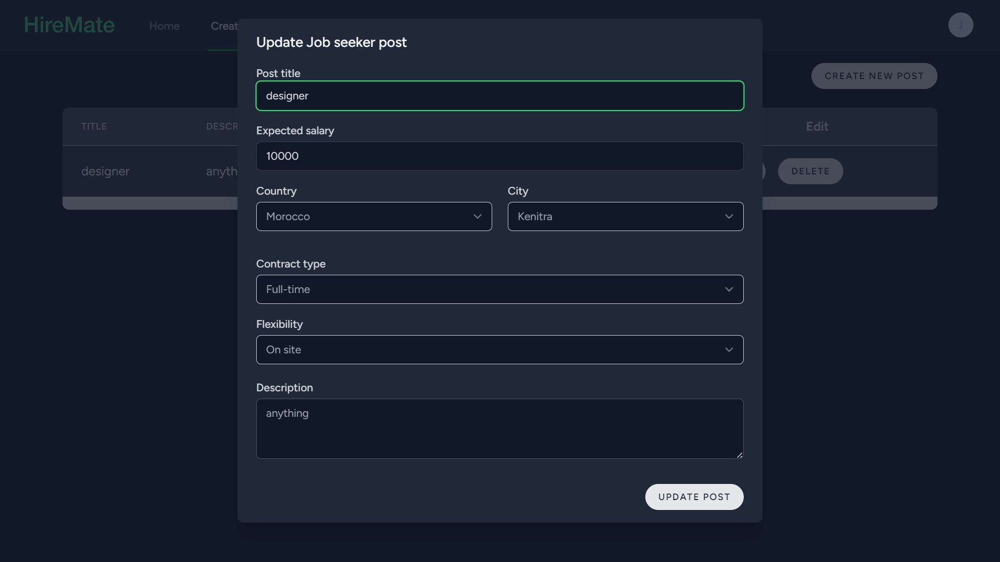
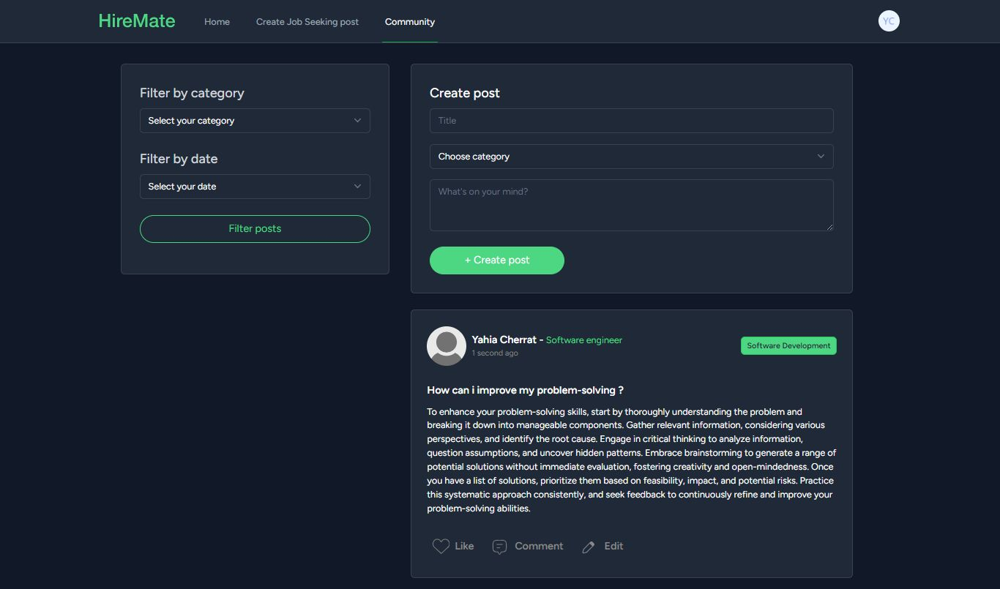
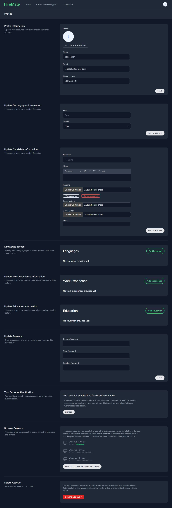

# HireMate

## Table of Contents

- [Description](#Description)
- [Badges](#Badges)
- [Visuals](#Visuals)
- [Installation](#Installation)
- [Usage](#Usage)
- [Support](#Support)
- [Roadmap](#Roadmap)
- [Contributing](#Contributing)
- [Authors and Acknowledgment](#Authors-and-Acknowledgment)
- [License](#license)

## Description

HireMate is a recruitment platform developed using Laravel, Livewire, Alpine.js, and Tailwind CSS. It facilitates job seekers in creating and customizing their profiles, searching for jobs, and tracking their applications. Employers can post job opportunities and manage applicants. The platform features a landing page, home page with personalized sections, a job-seeking page, and a community forum. It also supports both light and dark modes.

## Badges

[](https://laravel.com/)
[](https://laravel-livewire.com/)
[](https://tailwindcss.com/)

## Visuals

### Landing page


### Login page


### Home page


### Search page


### Activity page


### Job seeker posts page


### Community page


### Settings page


### Profile page


## Installation

1. Clone the repository:
   ```bash
   git clone https://github.com/Ilyass-Bezaiz/HireMate.git
   cd HireMate
   ```
2. Install dependencies:
   ```bash
   composer install
   npm install
   ```
3. Set up your environment:
   - Copy `.env.example` to `.env` and configure your database and other settings.
   ```bash
   php artisan key:generate
   ```
4. Run migrations:
   ```bash
   php artisan migrate
   ```
5. Serve the application:
   ```bash
   php artisan serve
   npm run dev
   ```

## Usage

- **Job Seeker**: Create a profile, search for jobs, apply, and track the status of your applications.
- **Employer**: Post job listings and manage applications.
- **Community**: Engage with other users by posting and commenting on job-related topics.

## Support

For any issues or support, please open an issue on [GitHub](https://github.com/Ilyass-Bezaiz/HireMate/issues).

## Roadmap

- Implement advanced filtering options for job search.
- Add an analytics dashboard for employers.
- Introduce a messaging feature for job seekers and employers.

## Contributing

Contributions are welcome! Please follow these steps:
1. Fork the repository.
2. Create a new branch: `git checkout -b feature-branch-name`.
3. Make your changes.
4. Commit your changes: `git commit -m 'Add some feature'`.
5. Push to the branch: `git push origin feature-branch-name`.
6. Open a pull request.

## Authors and Acknowledgment

- **Ilyass BEZAIZ**
- **Jawad ElHajjami**
- **Ibrahim BENSAADOUNE**
- **Yahia CHERRAT**


## License

This project is licensed under the MIT License - see the [LICENSE](LICENSE) file for details.

<!-- ## Project Status

The project is actively maintained. Future updates and improvements are planned. -->
